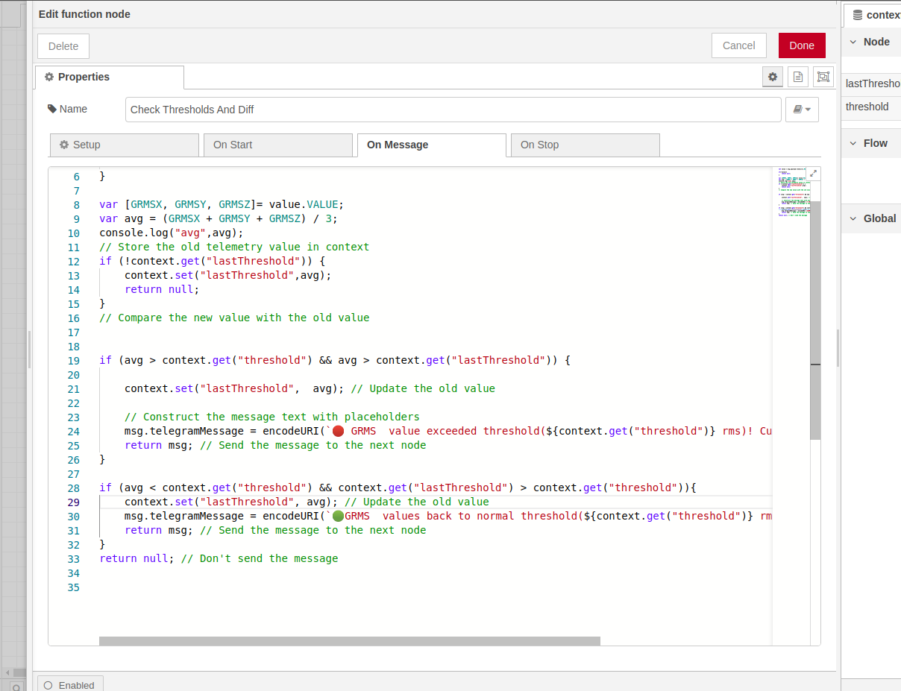

## How to Use the Senseway Node-RED Component

Follow these steps to seamlessly integrate Senseway devices and create an industrial monitoring system using the Senseway Node-RED component:

### 1. Installation

Before you begin, ensure you have Node-RED installed and running on your system. Then, install the Senseway Node-RED component:

1. Open your Node-RED instance.
2. Go to the "Manage Palette" menu.
3. Search for and install the "node-red-contrib-sensemore-senseway" package.
4. Restart Node-RED to activate the new component.

### 2. Import the Example Flow

An example Node-RED flow is provided to help you understand how to configure the Senseway component and receive vibration data telemetry values. Follow these steps to import the example flow:

1. Open your Node-RED instance.
2. Click on the three horizontal lines at the top right corner and select "Import."
3. Copy the contents of [example.flow.json](example.flow.json).
4. Paste the copied content into the import dialog and click "Import."

### 3. Configure the Senseway Device Node

Once you've imported the example flow, configure the Senseway Device node to match your device's settings:

1. Locate the "Senseway Device" node in your imported flow.
2. Open the node's properties by double-clicking on it.

   

3. Fill in the following information:
   - `deviceMac`: Enter the MAC address of your Senseway device.
   - `gatewayMac`: Enter the MAC address of the gateway.
   - `mqttUri`: Provide the MQTT broker URI (e.g., `mqtt://broker.example.com:1883`).
   - `mqttUsername` and `mqttPassword`: Enter your MQTT broker credentials.
   - Adjust other parameters as needed, such as accelerometer range, sampling rate, etc.
4. Click "Done" to save the configuration.

### 4. Configure Telegram Notifications (Optional)

To receive Telegram notifications for vibration data threshold changes, configure the Telegram node in the flow:

1. Open the "Check Thresholds And Diff" function node in your flow.

   

2. Locate the lines that start with `msg.token` and `msg.chatid`.
3. Replace `"Your TELEGRAM TOKEN"` with your actual Telegram bot token and `"Telegram Chat id"` with your desired chat ID.

### 5. Deploy and Test

1. Deploy your modified flow.
2. Observe the data coming from the Senseway device in the debug console or other output nodes you've added.
3. Adjust the threshold values and settings in the function node as needed for your monitoring requirements.

### 6. Visualize and Analyze

Use additional Node-RED nodes, such as dashboard nodes or other analytics nodes, to visualize and analyze the received vibration data telemetry values. This can help you monitor equipment health and make informed decisions.

## Industrial Monitoring System Benefits

By using the Senseway Node-RED component, you can create a robust industrial monitoring system that enables proactive maintenance, efficient operations, and data-driven insights for optimal equipment performance.

## Support

For any questions or assistance, please contact [Your Name](mailto:your@email.com).
